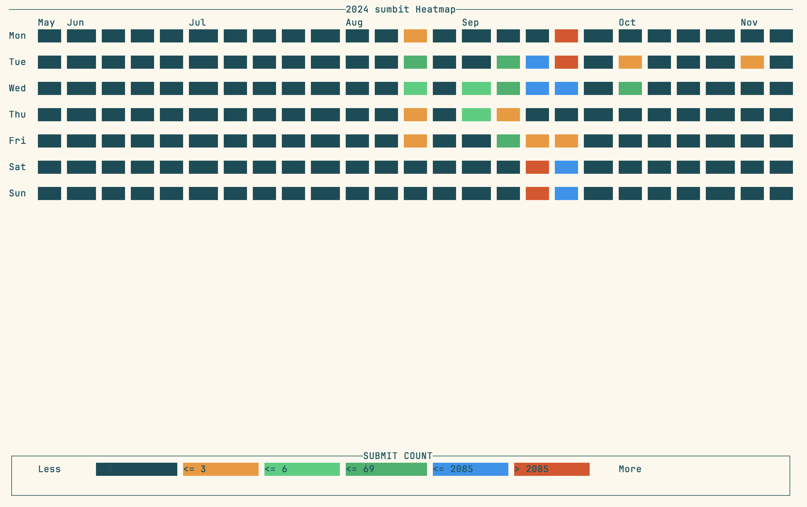

# DONDA

## Description

View your SLURM submit heatmap in the terminal.




## Install

```bash
cargo install --git https://github.com/wjwei-handsome/donda.git
```

for develop:

```bash
git clone https://github.com/wjwei-handsome/donda.git
cd donda
cargo build --release
./target/release/donda
```

## Usage

Basic usage:

```bash
donda
```
It will show the heatmap of the last 180 days.

You can specify the days to show:

```bash
donda -s 2024-06-01 -e 2024-11-17
```

More options please refer to `donda -h`.

## TODO

- [ ] Add color schemes

## Origin of the name

1. Many SLURM jobs **done** in your HPC.
2. [Donda](https://open.spotify.com/album/5CnpZV3q5BcESefcB3WJmz) is an album I really like, by Kanye West.

## Limits

The performance bottleneck is the `sacct` command. If you have a large number of jobs, it may take a long time to get the information.

## License

MIT

> Please **DO NOT** let your advisor or boss find out about this tool, unless you want them to realize that you haven't been submitting jobs on your weekend. XD